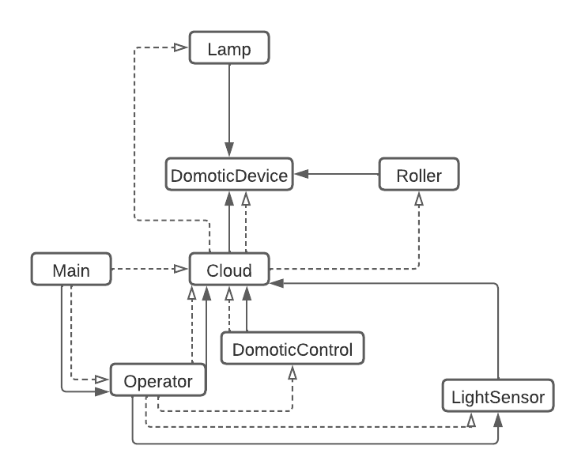

# Tarea 1 | ELO329 | Diseño y Programacion Orientada a Objetos

Simulacion y registro de dispositivos domoticos.

## Introducción

Este aplicacion esta centrada en el funcionamiento de dos aparatos electronicos domesticos (Cortinas y Lamparas), la principal caracteristica del programa es el hecho de que se comporta como una bitacora de eventos, en el cual se ira registrando cada movimiento o accion que se produzca cada x segundos.

### Compilación

```sh
make
```

### Ejecucion

Para ejecutar la aplicación lo puedes hacer con el siguiente comando:

```sh
java Main <archivo>.txt > <archivo>.csv
```

Tambien puede ejectuarse con el comando:

```sh
# Pero este comando no te permitira guardar la salida en un nuevo archivo
# solo lo imprimira por consola.
make run
```

### Limpiar

```sh
make clean
```

### Input

**Modelo:**

```txt
<#n_cortinas>   <#n_lamparas>   <#n_controles_cortinas> <#n_controles_lamparas>
<#w_velocity_n> <#length_cortina_n> <#channel_cortina_n>
<#channel_lampara_n>
<#channel_control_cortina_n>
<#channel_control_lampara_n>
<#tiempo[s]>    <Dispositivo>   <#channel>  <Instruccion>   [<Instruccion>]
```

**Ejemplo:**

```sh
2	1	1	1 # 2 Cortinas, 1 Lampara, 1 Control de Cortina y 1 Control de Lampara
2.1	1	1	2.5	1.5	1 # Al ser dos cortinas se entregan 6 datos separados en velocidad angular, longitud y canal por cada una.
0 # Se entrega solo un valor, ya que es una lampara
1 # Se entrega solo un valor, ya que es solo un control para la cortina
0 # Se entrega solo un valor, ya que es solo un control para la lampara
0	C	1	D # Tablon de Instrucciones ...
1	L	0	N
7	L	0	R	D
8	L	0	B	U
15	L	0	F
: # Finalizacion de Instrucciones
```

### Output

**La salida de esta aplicación puede datse de dos maneras, por consola o por un archivo:**

```sh
# ~ % java Main <archivo>.txt > <archivo>.csv
Time    RS0     RS1     L0R     L0G     L0B 
0.0     0       0       0       0       0   
1.0     8       7       255     255     255 
7.0     59      47      254     255     255 
8.0     67      53      254     255     255 
15.0    100     100     0       0       0     	
```

### Funcionamiento (Diagrama de Clases)



## Autores

Juan Chavez Toledo, ROL: **XXX.XXX.XXX-X**, [Correo USM](mailto:juan.chavezt@usm.cl).

Vicente Zúñiga Montenegro, ROL: **202.130.526-2**, [Correo USM](mailto:vicente.zunigam@usm.cl).

## Version

```sh
Domotic Simulation v1.0.0-2022 | First Homework | ELO329 POO - 2022
```